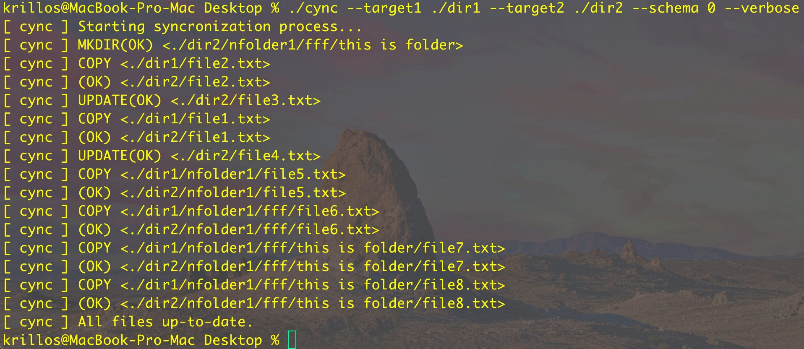

# cync
Syncing files accross directories and devices.

> **NOTE:** WIP &rarr; Only `--schema=0` option works for now!



## Usage
```
cync v1.0.0 -- syncing files accross directories and devices.
-t1 --target1 path to target folder 1
-t2 --target2 path to target folder 2
 -v --verbose verbose output
 -m --move_df move dot files
 -s  --schema syncronization schema
 -h    --help This help information.
OPTIONS:
        --schema=0  master-slave syncronization (default)
        --schema=1  sync both targets, but don't delete items
        --schema=2  sync both targets completely
EXAMPLE:
        cync --target1 ~/disk1 --target2 ~/disk2 --schema 0 --verbose
```

## Installation
### Requirements
* C compiler
* CMake

### Install from source
```sh
git clone --recurse-submodules https://github.com/kirillsaidov/cync.git
cd cync/
./build.sh  # linux, macos
./build.bat # windows
```

## LICENSE
All code is licensed under the MIT license.

